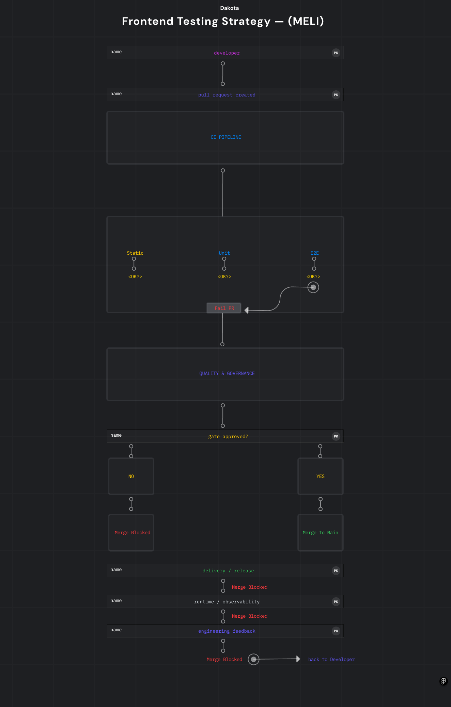

# Frontend Testing Strategy — (MELI)

---

## Context

This repository defines an **enterprise-grade frontend testing strategy**, aligned with how **large-scale product teams** (Mercado Libre–style organizations) approach **quality, reliability and delivery confidence**. 

This is **not a demo project**.

It represents **internal engineering standards**, decision-making criteria and testing boundaries used in real production environments with high traffic and strict SLAs.

---

## Goals

- Establish clear **testing ownership and boundaries**
- Optimize **signal over noise** in automated testing
- Reduce flaky pipelines
- Align testing effort with **business-critical flows**
- Enable fast feedback **without slowing delivery**

---

## Architecture Overview

**High-level flow:**

This mirrors real internal CI quality flows used in large-scale product platforms..

---

## Testing Layers

### esting Pyramid (Applied, not theoretical)

- **E2E (Playwright / Cypress)**  
  Covers only **critical user journeys**
- **Contract tests (Java)**  
  Frontend ↔ Backend expectations
- **Manual / exploratory testing**  
  UX validation and edge cases

Unit testing is intentionally **out of scope** for this repository.

---

## What We Test

Defined in [`strategy/what-to-test.md`](strategy/what-to-test.md):

- Authentication and session handling
- Search and discovery
- Checkout / conversion paths
- Error handling and fallback states
- Cross-environment stability

Tests exist **only where failure impacts revenue, trust or compliance**.

---

## What We Do NOT Test

Defined in [`strategy/what-not-to-test.md`](strategy/what-not-to-test.md):

- Visual styling and UI details
- Third-party-owned logic
- Implementation details
- Static content
- Micro-interactions

This avoids:
- brittle tests  
- slow pipelines  
- false confidence  

---

## Tooling Decisions

### Playwright
- Deterministic execution
- Strong TypeScript typing
- Parallel execution
- CI-first design

### Cypress
- Legacy and regression coverage
- Fast developer feedback
- Team familiarity

### Java (Contract Testing)
- Validates API assumptions
- Independent from frontend runtime
- Ensures backend alignment

---

## Environments & Test Data

Defined in [`strategy/environments.md`](strategy/environments.md):

- Isolated test environments
- Controlled test users
- Stable, versioned fixtures
- No shared mutable state

Test data strategy is documented in  
[`strategy/test-data-strategy.md`](strategy/test-data-strategy.md).

---

## Quality Gates

Quality is enforced through **automation**, not discipline alone:

- CI must pass before merge
- Critical E2E flows are mandatory
- Zero tolerance for flaky tests
- Fast failure over silent degradation

Metrics and expectations are defined in  
[`docs/quality-metrics.md`](docs/quality-metrics.md).

---

## CI Integration

Example pipeline available at [`ci/test-pipeline.yml`](ci/test-pipeline.yml):

- Deterministic execution
- Clear failure visibility
- Parallel E2E execution
- Designed to scale with team size

---

## Engineering Philosophy

> “We test to reduce risk, not to increase metrics.”

This repository reflects:

- Senior-level trade-offs
- Production-oriented thinking
- Long-term maintainability
- Team scalability over time